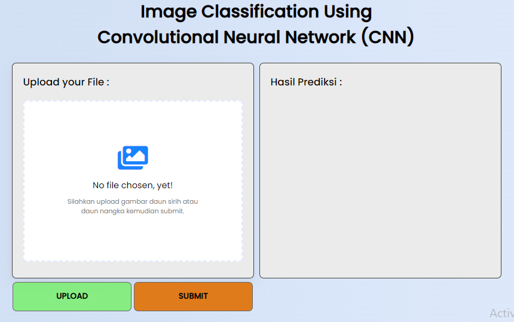

# Deployment Model CNN (Sirih and Nangka)

## Deskripsi singkat

Repositori ini merupakan sebuah repositori untuk klasifikasi daun sirih dengan daun nangka menggunakan Convolutional Neural Network (CNN). 

#

## Cara kerja Web

